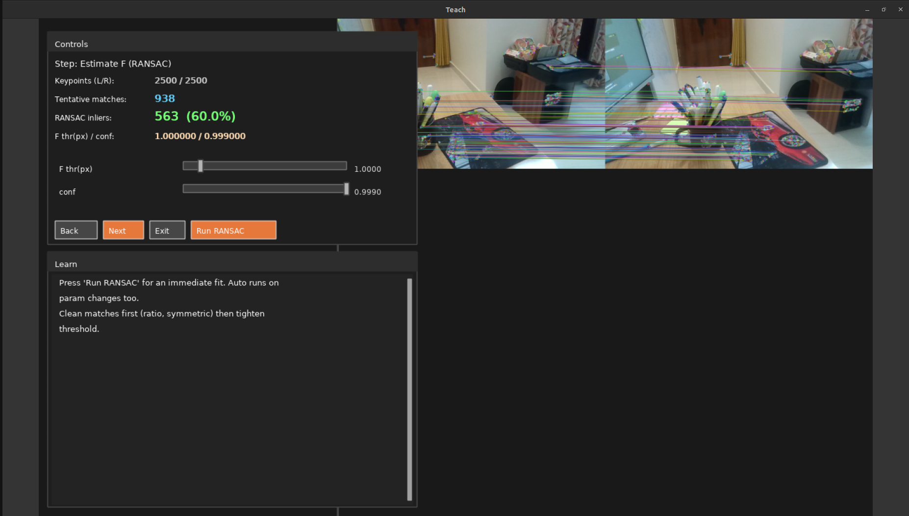

# Epipolar Geometry Visualizer

[](#)
[](#)
[](#)
[](#license)

**Interactive tool to learn and visualize epipolar geometry** from two images.  
Detect ORB features, match them, run robust **RANSAC** to estimate **F/E**, draw **epipolar lines**, and step through the full pipeline in an in-app **Teach Mode**.

<p align="center">
  
</p>

---

## ✨ Features

- **Teach Mode**: step-by-step panels explaining ORB, matching, RANSAC, F/E math & intuition.
- **Live parameters**: change feature count, Lowe ratio, symmetric check, RANSAC thresholds/confidence.
- **Clean UI**: docked side panels (draggable within dock), solid white text, mouse-wheel scrolling.
- **Robust geometry**: Essential (with intrinsics) or Fundamental (without), with inlier visualization.
- **Polished visuals**: epipolar overlays, metrics strip (keypoints/matches/inliers).
- **Works with KITTI/TUM or any stereo/nearby pair.**

---

## 🧰 Build & Run

### Dependencies
- C++17 or newer
- CMake 3.16+
- OpenCV 4.x (`core`, `imgproc`, `highgui`, `features2d`, `calib3d`)
- (Optional) `opencv-freetype` for crisp text (falls back to Hershey otherwise)

**Ubuntu example**
```bash
sudo apt update
sudo apt install -y build-essential cmake \
    libopencv-dev \
    libopencv-contrib-dev \
    libfreetype6-dev
# on some distros: sudo apt install libopencv-freetype4

