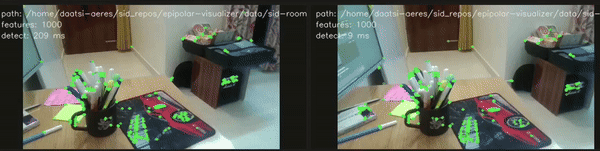
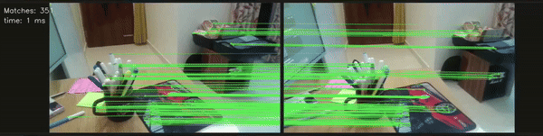
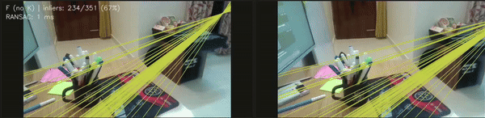

# Epipolar Geometry Visualizer (C++/OpenCV)

**Interactive tool to visualize epipolar geometry for stereo images.**  
Load two images, see feature detection, descriptor matching, and epipolar lines update live—plus inlier stats and timing per stage. Built for learners.

---

## Why this repo?

I built a tiny C++/OpenCV repo you can run locally to *feel* epipolar geometry instead of just reading about it: clone, build with CMake, run the app, and pick any two images (L/R) from a file dialog. The window shows three side-by-side rows—first the detected features, then the descriptor matches, and finally the epipolar lines—with small overlays for counts, inlier ratio, and per-stage timings. As soon as both images load, you’ll see matches and lines appear with sensible defaults; from there, tweak the parameters or switch between fundamental vs. essential estimation (if you provide intrinsics) and watch in real time how the inlier set, the lines, and the inferred pose behavior change. It’s a fast way to build intuition for what each stage is doing: how detection density affects matching, how ratio test vs. cross-check shapes outliers, how the RANSAC threshold trades clean geometry for coverage, and where the epipoles land when the camera mostly translates vs. rotates.

---

## Demo 

### Features demo


### Matches demo


### Epipolar demo


---

## How to use it

### 1) Install prerequisites (Linux)
```bash
sudo apt update
sudo apt install -y build-essential cmake pkg-config libopencv-dev zenity
```
- `libopencv-dev` → OpenCV headers/libs.
- `zenity` → native file picker (used by tinyfiledialogs).

### 2) Build
```bash
git clone <your-repo-url> epipolar-visualizer
cd epipolar-visualizer
mkdir -p build && cd build
cmake -DCMAKE_BUILD_TYPE=Release ..
cmake --build . -j
```

### 3) Run
```bash
./epipolar_viz
```

### 4) Load images
- Press **`L`** → choose the **left** image.
- Press **`R`** → choose the **right** image.

As soon as both are loaded:
- Row 1: **features** (ORB keypoints, count, detection time).  
- Row 2: **matches** (lines between correspondences, count, time).  
- Row 3: **epipolar lines** (inliers/total %, RANSAC time, **F** vs **E**).

### 5) Keyboard shortcuts
- **L** — open left image  
- **R** — open right image  
- **Q** / **Esc** — quit

---

## Parameters you can change (right panel)

### Feature detection (ORB)
- **nfeatures** — target number of keypoints kept (higher = more coverage, more compute).
- **FAST threshold** — sensitivity: lower → more points (noisier), higher → fewer (cleaner).
- **scale factor**, **pyramid levels** — scale invariance vs. speed trade-off (1.2–1.4, 6–12 levels are common).

### Matching
- **Use FLANN** — approximate NN (ORB descriptors are converted to float for FLANN).  
  *Note:* **Cross-check** is **disabled** in FLANN mode.
- **Ratio test** — Lowe’s 2-NN filter (typical 0.70–0.85).
- **Cross-check (BF only)** — mutual best match; fewer but cleaner. (Ratio test is ignored when on.)

### Essential / RANSAC
- **Inlier threshold (px)** — distance tolerance to epipolar constraint. Lower = stricter inliers.
- **Confidence** — RANSAC success probability; higher → more iterations (slower, more stable).
- **Use intrinsics (Essential & pose)** — switch from **F** (uncalibrated) to **E** (calibrated) and recover pose \\(R,t\\) up to scale.  
  - Set **fx, fy, cx, cy** if you know them (the app seeds reasonable defaults from image size).

---

## What you’ll see & how to read it

- **Row 1 — Features:** ORB keypoints over each image with counts & detection times.  
- **Row 2 — Matches:** tentative correspondences (after ratio test or cross-check).  
  Good matches form consistent strands; random spaghetti = too many outliers.  
- **Row 3 — Epipolar:** lines from the final model (F or E→F). Overlay shows **inliers/total** and **RANSAC time**.  
  - Lines that **converge** toward a point indicate **epipoles** (projection of the opposite camera).  
  - Parallel (often horizontal) lines → epipoles at infinity → rectified-like motion (mostly sideways baseline).  
  - Radiating lines near center → forward/backward motion component; pivoting patterns → rotation.

**Remember:** From a single pair you get **motion up to scale** and **line constraints**—not metric depth. Without baseline scale (stereo calibration) or additional views, you can’t recover exact 3D point coordinates.

---

## Project structure

```
epipolar-visualizer/
├─ CMakeLists.txt
├─ src/
│  └─ main.cpp
├─ include/
├─ third_party/
│  ├─ cvui/               # header-only UI
│  └─ tinyfiledialogs/    # file picker (h + c)
├─ data/                  # put sample images here (optional)
└─ docs/
   └─ media/              # GIFs/screenshots for README/Medium
```

### CMake notes

This project compiles both C and C++ (for tinyfiledialogs):
```cmake
project(EpipolarViz LANGUAGES C CXX)
add_executable(epipolar_viz
  src/main.cpp
  third_party/tinyfiledialogs/tinyfiledialogs.c
)
```

---

## Implementation notes & gotchas

- **BF + cross-check vs ratio test:** mutually exclusive in BF. Cross-check uses 1-NN; KNN+ratio needs cross-check **off**.  
- **FLANN with ORB:** ORB is binary; FLANN expects float. We convert descriptors to `CV_32F`. Cross-check is disabled in FLANN path.  
- **RANSAC threshold:** the most impactful knob. Try 1–2 px for undistorted images; raise slightly if no inliers.  
- **Intrinsics:** if known, enable **Use intrinsics** for \\(E\\) and pose recovery. Otherwise stick to \\(F\\); the lines still tell the story.  
- **Immediate updates:** a versioned recompute pipeline (features → matches → epipolar) ensures loading images triggers downstream updates without “nudging” params.  
- **Performance:** detection, matching, and RANSAC timings are overlaid so you can see where time goes.

---

## Troubleshooting

- **0 matches or 0 inliers**
  - Lower **FAST threshold** (more features).  
  - Relax **ratio** (higher) or **RANSAC threshold** (slightly larger px).  
  - Ensure both images overlap the **same** scene region.

- **Crash mixing options**
  - BF with `crossCheck=true` cannot use KNN/ratio (the app guards this).  
  - If FLANN ever complains about types, ensure descriptors are converted to `CV_32F` (the app does this).

- **Weird epipolar lines**
  - Wrong or missing intrinsics can inflate residuals for \\(E\\).  
  - Significant distortion? Consider undistorting first.

---

## Roadmap

- “Show **inliers only**” toggle in Matches row.  
- Save results (PNG of rows, JSON of params + stats).  
- Rectification demo (compute \\(H_l, H_r\\)).  
- Homography-vs-Fundamental model selection on planar scenes.  
- Distance histogram / inlier distribution plots.  
- Separate modules/files, unit tests for geometry helpers.

---

---

## License

MIT (or your preferred license).  
Replace `<Your Name>` and year below and drop this into `LICENSE`:

```
MIT License

Copyright (c) 2025 <Your Name>
...
```

---

## Acknowledgements

- OpenCV team for the computer vision workhorse.  
- `cvui` by Dovyski for a minimal UI on top of OpenCV windows.  
- `tinyfiledialogs` for a dead-simple cross-platform file picker.

---

## Contributing

PRs and issues welcome—especially around new demos, parameter presets, and performance/UX polish.